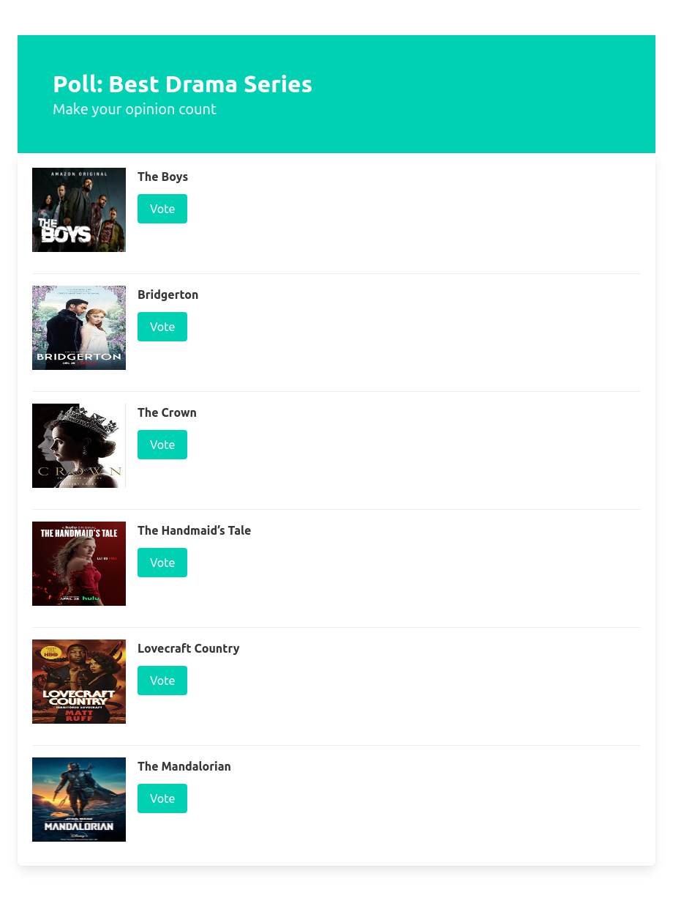
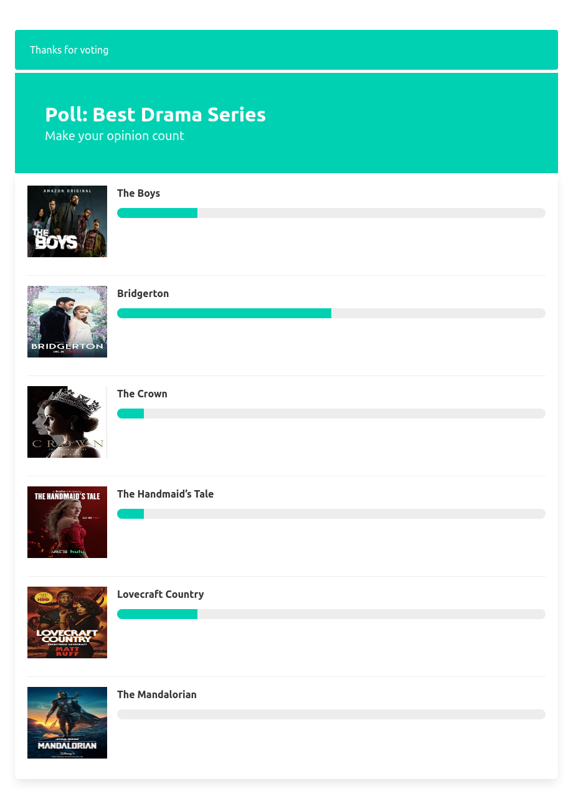

# One CakePHP project a day challenge - Day 05 Polls Emmy Edition with Bulma CSS Framework

On this project I'm using CakePHP 4 (including CounterCache behavior ) and https://bulma.io/

## Steps to create this projecta

- c139c74 Initial
  ```
  composer create-project --prefer-dist cakephp/app
  ```
- 1fa1bcc Added Bulma CSS Framework
- b59ed83 Migrations:
  ```
  bin/cake bake migration CreatePolls name photo_url created
  bin/cake bake migration CreateOptions poll_id name photo_url response_count:integer
  bin/cake bake migration CreateResponses option_id created
  bin/cake migrations migrate
  bin/cake bake model Polls
  bin/cake bake model Options
  bin/cake bake model Responses
  ```
- 2b35d01 Added action to view poll
- 2a52dba Added action to vote and added CounterCache behavior to populate response_count in options table
- c3059e2 Show Poll Result
- 6d5f9c5 Improved alert style with bulma css classes

## Links
- https://book.cakephp.org/4/en/orm/behaviors/counter-cache.html
- https://bulma.io/documentation

# Poll View Page




